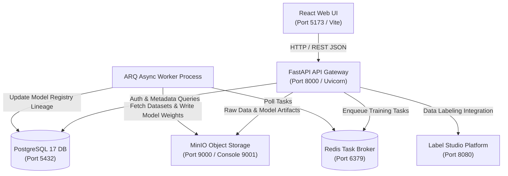
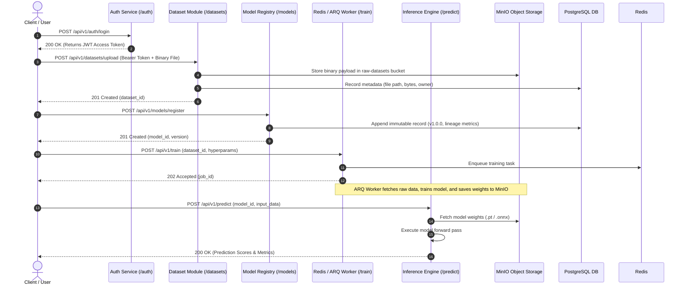

ผมไม่ push ไฟล์งานของ agent มานะครับในส่วนของ agent_folder กับไฟล์ .md บางไฟล์ (ในตอนทำงานเอเจนผมจะใช้โฟลเดอร์พวกนี้ทำงาน)

# FastAPI AI Ecosystem Backend Workspaces


An end-to-end modern AI platform combining a high-performance FastAPI backend microservice architecture with a modern React (Vite) frontend web application. The platform provides secure user authentication, object storage integration with MinIO, dataset metadata management with PostgreSQL 17, an append-only machine learning model registry, asynchronous automated training pipelines backed by Redis and ARQ, component integrations for Label Studio and MinIO, automated OpenAPI snapshot exporting, and structured JSON system logging.

---

## Background Service Management (ระบบสั่งการรัน/หยุดเบื้องหลัง)

จัดการเปิด, ปิด, รีสตาร์ท หรือดูสถานะของทุก Services ในระบบแบบเบื้องหลัง (Background Daemon) ได้ง่ายๆ ด้วยคำสั่งเดียวผ่านสคริปต์ `./scripts/manage` (หรือ `./manage`):

```bash
# เริ่มต้นทำงานทุก Service พร้อมกันในเบื้องหลัง (Docker Containers + Frontend)
./scripts/manage start all

# ตรวจสอบสถานะการทำงานของทุก Service
./scripts/manage status

# ⏹ สั่งหยุดการทำงานของทุก Service
./scripts/manage stop all

# รีสตาร์ททุก Service ทั้งระบบ
./scripts/manage restart all
```

### คำสั่งควบคุมแยกตาม Service:

| Service ที่ต้องการจัดการ | คำสั่ง Start (รันเบื้องหลัง) | คำสั่ง Stop (หยุด) | คำสั่ง Restart | ดู Log สด |
| :--- | :--- | :--- | :--- | :--- |
| **ทั้งหมด (All Services)** | `./scripts/manage start all` | `./scripts/manage stop all` | `./scripts/manage restart all` | `./scripts/manage logs all` |
| **Frontend UI (React/Vite)** | `./scripts/manage start frontend` | `./scripts/manage stop frontend` | `./scripts/manage restart frontend` | `./scripts/manage logs frontend` |
| **FastAPI Backend Gateway** | `./scripts/manage start backend` | `./scripts/manage stop backend` | `./scripts/manage restart backend` | `./scripts/manage logs backend` |
| **Trainer Worker (ARQ)** | `./scripts/manage start trainer` | `./scripts/manage stop trainer` | `./scripts/manage restart trainer` | `./scripts/manage logs trainer` |
| **Infrastructure รวม (DB/Redis/MinIO/Label-Studio)** | `./scripts/manage start infra` | `./scripts/manage stop infra` | `./scripts/manage restart infra` | - |
| **PostgreSQL 17** | `./scripts/manage start db` | `./scripts/manage stop db` | `./scripts/manage restart db` | `./scripts/manage logs db` |
| **Redis Cache/Queue** | `./scripts/manage start redis` | `./scripts/manage stop redis` | `./scripts/manage restart redis` | `./scripts/manage logs redis` |
| **MinIO Object Storage** | `./scripts/manage start minio` | `./scripts/manage stop minio` | `./scripts/manage restart minio` | `./scripts/manage logs minio` |
| **Label Studio Annotation** | `./scripts/manage start label-studio` | `./scripts/manage stop label-studio` | `./scripts/manage restart label-studio` | `./scripts/manage logs label-studio` |

>  **Tip:** สามารถเรียกผ่าน Shortcut สั้นๆ จาก Root Directory ได้เช่นกัน เช่น `./manage status` หรือ `./manage restart all`

---

## (Table of Contents)

1. [Background Service Management](#-background-service-management-ระบบสั่งการรันหยุดเบื้องหลัง)
2. [Quick Start & Setup Guide](#1-quick-start--setup-guide)
   - [Prerequisites](#prerequisites)
   - [Step 1: Environment Setup](#step-1-environment-setup)
   - [Step 2: Start Backing Services](#step-2-start-backing-services)
   - [Step 3: Run FastAPI Backend Server](#step-3-run-fastapi-backend-server)
   - [Step 4: Run React Frontend Application](#step-4-run-react-frontend-application)
   - [System Access Endpoints & Web Interfaces](#system-access-endpoints--web-interfaces)
3. [API Specification Table](#api-specification-table)
3. [System Architecture & Component Diagrams](#2-system-architecture--component-diagrams)
   - [2.1 High-Level Architecture Diagram](#21-high-level-architecture-diagram)
   - [2.2 System Data Flow & Sequence Diagram](#22-system-data-flow--sequence-diagram)
   - [2.3 Core Architectural Principles](#23-core-architectural-principles)
4. [Project Directory Structure](#3-project-directory-structure)
5. [OpenAPI Snapshot Exporter Tool](#4-openapi-snapshot-exporter-tool)
6. [Component APIs Integration (MinIO & Label Studio)](#5-component-apis-integration-minio--label-studio)
7. [DOCX Report Generation](#6-docx-report-generation)
8. [Directory Documentation & Subdirectory READMES](#7-directory-documentation--subdirectory-readmes)

---

## 1. Quick Start & Setup Guide

### Prerequisites
Before running the application, ensure the following software tools are installed on your environment:
- **Python 3.8+** (Python 3.10+ recommended)
- **Node.js 18+** & `npm`
- **Docker & Docker Compose** (for running backing services: PostgreSQL 17, Redis, MinIO, Label Studio)

### Step 1: Environment Setup
Copy the environment template file to create your active `.env` configuration file:
```bash
cp .env.sample .env
```
Review `.env` if you need to adjust database passwords, secret keys, or host ports.

### Step 2: Start Backing Services
Launch PostgreSQL 17, Redis, MinIO Object Storage, and Label Studio in background mode:
```bash
docker-compose up -d
```
Or using the Docker CLI V2 command:
```bash
docker compose up -d
```

### Step 3: Run FastAPI Backend Server
Execute the launcher script `run.sh`, which automatically detects virtual environments and starts the Uvicorn server:
```bash
./run.sh
```
To run the FastAPI backend server on a custom port (for example, port `8000`):
```bash
PORT=8000 ./run.sh
```

### Step 4: Run React Frontend Application
In a separate terminal, navigate to the `frontend` directory, install all Node dependencies, and start the Vite development server:
```bash
cd frontend
npm install
npm run dev
```

### System Access Endpoints & Web Interfaces

| Application / Service | Endpoint URL | Description & Credentials |
| :--- | :--- | :--- |
| **React Frontend UI** | [http://localhost:5173](http://localhost:5173) | User Registration, OAuth Login, and Protected Token Dashboard |
| **FastAPI Swagger OpenAPI Docs** | [http://localhost:8000/docs](http://localhost:8000/docs) | Interactive API Exploration and Endpoint Testing |
| **FastAPI ReDoc Documentation** | [http://localhost:8000/redoc](http://localhost:8000/redoc) | Alternative Clean API Reference |
| **MinIO Console Interface** | [http://localhost:9001](http://localhost:9001) | User: `minioadmin` \| Password: `minioadmin` |
| **Label Studio Platform** | [http://localhost:8080](http://localhost:8080) | Data Annotation and Labeling Platform |

---

## API Specification Table

| โดเมนงาน (Domain) | HTTP Verb | API Endpoint | หน้าที่และการทำงาน (Functionality) |
| :--- | :---: | :--- | :--- |
| **1. Authentication** | `POST` | `/api/v1/auth/register` | สมัครสมาชิกใหม่ เข้ารหัส Password ด้วย Bcrypt |
| | `POST` | `/api/v1/auth/login` | ตรวจสอบรหัสผ่าน ออก Stateless JWT Access Token |
| | `GET` | `/api/v1/auth/me` | ดึงข้อมูลโปรไฟล์ผู้ใช้งานปัจจุบันที่ยืนยันตัวตนแล้ว |
| **2. Dataset Storage** | `POST` | `/api/v1/datasets/upload` | สตรีมไฟล์ดิบไป MinIO (`raw-datasets`) และบันทึก Metadata ลง PostgreSQL |
| | `GET` | `/api/v1/datasets` | ดูรายการชุดข้อมูลทั้งหมด รองรับ Pagination (`skip/limit`) |
| | `GET` | `/api/v1/datasets/{dataset_id}` | ดึงรายละเอียดชุดข้อมูลรายตัวตาม ID |
| **3. Model Registry** | `POST` | `/api/v1/models/upload` | อัปโหลดและลงทะเบียนโมเดลเวอร์ชันใหม่แบบ Append-Only Log |
| | `GET` | `/api/v1/models` | ดูประวัติประวัติเวอร์ชันโมเดลทั้งหมดในระบบ (Audit Trail) |
| | `GET` | `/api/v1/models/latest` | ดึงไฟล์โมเดลเวอร์ชันล่าสุดที่เสถียรสำหรับนำไปทำนายผล |
| | `GET` | `/api/v1/models/{model_id}` | ดึงรายละเอียดโมเดลตาม ID |
| **4. Async Training** | `POST` | `/api/v1/training/start` | สั่งเริ่มฝึกโมเดล คืนค่า **`202 Accepted`** + `job_id` โยนงานเข้า Redis Queue |
| | `GET` | `/api/v1/training/status/{job_id}` | ตรวจสอบสถานะและความคืบหน้าการฝึกโมเดล (Polling) |
| | `POST` | `/api/v1/training/cancel/{job_id}` | ยกเลิกงานฝึกโมเดลในคิว |
| **5. Inference & Monitoring** | `POST` | `/api/v1/predict` | ส่งข้อมูลเข้าประมวลผลทำนายผลความเร็วสูง (Low-latency Inference) |
| | `GET` | `/api/v1/system/health` | ตรวจเช็คสุขภาพการเชื่อมต่อ PING ไปยัง PostgreSQL, MinIO, Redis, Label Studio |
| | `GET` | `/api/v1/system/logs` | เรียกดูประวัติ Log การทำงานรูปแบบ Structured JSON |
| **6. MinIO Component API** | `GET` | `/api/v1/minio/buckets` | ดูรายการ MinIO Storage Buckets ทั้งหมดในระบบ |
| | `POST` | `/api/v1/minio/upload` | อัปโหลดไฟล์โดยตรงผ่าน MinIO API Component Router |
| | `GET` | `/api/v1/minio/presigned-url` | สร้าง Presigned Download URL สำหรับดาวน์โหลดไฟล์ |
| | `GET` | `/api/v1/minio/health` | ตรวจสอบสถานะการเชื่อมต่อ MinIO S3 Service |
| **7. Label Studio Component API**| `GET` | `/api/v1/label-studio/health` | ตรวจสอบสถานะการเชื่อมต่อ Label Studio Data Annotation Service |
| | `GET` | `/api/v1/label-studio/projects` | ดึงรายการ Annotation Projects ทั้งหมด |
| | `GET` | `/api/v1/label-studio/projects/{id}` | ดึงรายละเอียดโครงการ และสถิติ Labeling ตาม ID |
| | `GET` | `/api/v1/label-studio/tasks` | ดึงรายการ Data Tasks ภายใน Label Studio Project |

---

## 2. System Architecture & Component Diagrams

### 2.1 High-Level Architecture Diagram

The system follows a clean microservices architecture decoupling the React web interface, FastAPI gateway router, database persistence, object storage, and background processing workers.

#### Mermaid Diagram


#### ASCII Block Diagram
```text
+-------------------------------------------------------------------+
|                        React Web Frontend                         |
|                   (Vite Server - Port 5173)                       |
+-------------------------------------------------------------------+
                                  |
                                  | HTTP / REST API Requests
                                  v
+-------------------------------------------------------------------+
|                       FastAPI API Gateway                         |
|                   (Uvicorn - Port 8000)                           |
+-------------------------------------------------------------------+
         |                        |                        |
         | SQL Metadata           | S3 Protocol            | Enqueue Jobs
         v                        v                        v
+------------------+     +------------------+     +------------------+
|  PostgreSQL 17   |     |  MinIO Storage   |     |   Redis Queue    |
| (Database: 5432) |     |  (Bucket: 9000)  |     |  (Broker: 6379)  |
+------------------+     +------------------+     +------------------+
                                                           |
                                                           | Task Consumption
                                                           v
                                                  +------------------+
                                                  | ARQ Async Worker |
                                                  | (CPU/GPU Engine) |
                                                  +------------------+
```

---

### 2.2 System Data Flow & Sequence Diagram

The end-to-end data processing workflow covers user authentication, raw dataset storage in MinIO, immutable version registration, asynchronous task execution, and inference.

#### Mermaid Sequence Diagram


---

### 2.3 Core Architectural Principles

- **Separation of Concerns & Clean Architecture:** The application strictly separates the UI presentation layer, FastAPI route controllers, business logic services, database ORM models, and data validation schemas.
- **Dependency Injection & Environment Isolation:** FastAPI dependency injection (`Depends`) enforces authentication context, database session lifecycle management, and runtime environment variable isolation via `.env` and Pydantic settings.
- **Immutability Pattern for Model Registry:** Model registry entries follow an append-only architecture pattern where records are strictly additive. Previous versions (`v1.0.0`, `v1.1.0`) are preserved indefinitely to guarantee reproducible model lineage and reliable rollback safety.
- **Non-blocking Asynchronous Task Queue Execution:** High-latency compute jobs (such as ML model training) are offloaded to background ARQ workers via Redis, allowing the API gateway to return immediate asynchronous HTTP `202 Accepted` responses.
- **Structured JSON System Logging:** Diagnostic logs across gateway, database, storage, and application components are generated in structured JSON format, enabling unified log analysis, tracing, and automated monitoring.

---

## 3. Project Directory Structure

```text
ai-ecosystem-workspace/
├── backend/                       # FastAPI Microservice Workspace
│   ├── README.md                  # Backend Workspace Root Documentation
│   ├── main.py                    # Gateway Entrypoint, Middleware & Router Registrations
│   ├── compose.yml                # Multi-container Orchestration Config
│   ├── db/                        # Database Engine & Session Lifecycle
│   │   └── README.md              # Database Module Documentation
│   └── app/                       # Application Submodules
│       ├── README.md              # App Package Documentation
│       ├── core/                  # App Settings & Security (Bcrypt/JWT)
│       │   └── README.md          # Core Module Documentation
│       ├── routers/               # API Controllers (auth, datasets, models, train, minio, label_studio, health)
│       │   └── README.md          # Routers Catalog & Endpoint Documentation
│       ├── schemas/               # Validation Schemas & Data Transfer Objects (DTOs)
│       ├── services/              # S3 MinIO Storage & ARQ Redis Worker Services
│       │   └── README.md          # Services Integration Documentation
│       ├── models/                # SQLAlchemy Database Entities
│       │   └── README.md          # Database Entities Documentation
│       └── utils/                 # Custom JSON Structured Logger & Path Helpers
├── frontend/                      # React Frontend Web Application (Vite)
├── scripts/                       # System Automation & Documentation Exporters
│   ├── export_openapi_snapshot.py # Utility to export OpenAPI specs into CSV/XLSX
│   └── generate_assignment_report_docx.py # Executive Assignment Report Generator
├── tests/                         # Automated Integration & Unit Tests
│   └── README.md                  # Testing Guidelines & Test Suite Overview
├── sandbox/                       # Experimental Playgrounds & Proof-of-Concept Scripts
│   └── README.md                  # Sandbox Workspace Documentation
├── logs/                          # System Subsystem JSON Log Files
│   └── README.md                  # JSON Logging Schema & Log Catalog
├── assets/                        # Diagrams, Mockups & Verification Screenshots
│   └── README.md                  # Asset Inventory & Media Reference
├── agent_folder/                  # Agent Workspace, Slide Specifications & Reports
│   └── README.md                  # Agent Workspace Documentation
├── diagrams/                      # Draw.io Architecture Source Diagrams
│   └── README.md                  # Diagram Specifications & Editing Guide
├── .env.sample                    # Environment Variables Configuration Template
├── compose.yml                    # Docker Compose Orchestration (PostgreSQL, Redis, MinIO, Label Studio)
├── pyproject.toml                 # Python Project Metadata & Dependencies
├── run.sh                         # FastAPI Uvicorn Server Launcher Script
├── architecture.md                # System Architecture Documentation
└── README.md                      # Project Root Documentation
```

---

## 4. OpenAPI Snapshot Exporter Tool

The repository includes an automated OpenAPI spec exporter (`scripts/export_openapi_snapshot.py`) to extract OpenAPI schemas directly from the FastAPI application and convert them into CSV and Excel formats for system documentation snapshots and auditing.

### How to Run Exporter
```bash
python scripts/export_openapi_snapshot.py
```

### Generated Artifacts
- `openapi_snapshot.csv`: Complete tabular breakdown of all routes, HTTP methods, summaries, parameters, tags, and response codes.
- `openapi_snapshot.xlsx`: Formatted Excel workbook containing API endpoint specifications.

---

## 5. Component APIs Integration (MinIO & Label Studio)

The system exposes specialized FastAPI router modules for interacting with core ecosystem backing services:

### MinIO Object Storage Component Router (`backend/app/routers/minio_router.py`)
- **GET `/api/v1/minio/buckets`**: Retrieves list of active MinIO storage buckets.
- **POST `/api/v1/minio/upload`**: Uploads binary payloads directly to object storage.
- **GET `/api/v1/minio/presigned-url`**: Generates temporary presigned URLs for secure downloading.
- **GET `/api/v1/minio/health`**: Verifies MinIO S3 cluster health and latency.

### Label Studio Annotation Router (`backend/app/routers/label_studio_router.py`)
- **GET `/api/v1/label-studio/health`**: PINGs Label Studio REST API service status.
- **GET `/api/v1/label-studio/projects`**: Lists all data labeling projects and metadata.
- **GET `/api/v1/label-studio/projects/{id}`**: Retrieves project details and labeling progress statistics.
- **GET `/api/v1/label-studio/tasks`**: Retrieves annotation tasks assigned within a project.

---

## 6. DOCX Report Generation

To generate the comprehensive executive report `Assignment_Report_AIECO.docx` matching all academic and technical requirements, execute the Python compilation script:

```bash
python scripts/generate_assignment_report_docx.py
```

### Features of Generated DOCX Report
- Complete System Architecture & Folder Structure explanations.
- System Components & Installed Python Libraries documentation.
- Comprehensive Backend API Gateway & Endpoint reference tables.
- FastAPI OpenAPI Metadata, Interactive Docs (`/docs`), ReDoc (`/redoc`), and OpenAPI Snapshot Converter description.
- Precise terminal shell commands for launching services and running test suites.
- Clear visual image placeholder callouts (`[ภาพประกอบที่ X: ... (รันคำสั่ง ... แล้วแคปภาพใส่ตรงนี้)]`) providing exact screenshot capture commands for manual insertion into Microsoft Word.

---

## 7. Directory Documentation & Subdirectory READMES

All key subdirectories within the repository feature dedicated `README.md` files describing their role in the architecture:

- [`backend/README.md`](file:///home/kimbiaw/ai-eco/backend/README.md) - FastAPI Microservice Overview & Startup Commands
- [`backend/app/README.md`](file:///home/kimbiaw/ai-eco/backend/app/README.md) - Submodule Package Layout & Architecture
- [`backend/app/routers/README.md`](file:///home/kimbiaw/ai-eco/backend/app/routers/README.md) - API Endpoint Catalog & Route Documentation
- [`backend/app/services/README.md`](file:///home/kimbiaw/ai-eco/backend/app/services/README.md) - MinIO Storage & ARQ Redis Worker Services
- [`backend/app/models/README.md`](file:///home/kimbiaw/ai-eco/backend/app/models/README.md) - Database ORM Models & Append-Only Versioning
- [`backend/app/core/README.md`](file:///home/kimbiaw/ai-eco/backend/app/core/README.md) - Environment Configuration & Security Modules
- [`backend/db/README.md`](file:///home/kimbiaw/ai-eco/backend/db/README.md) - Database Session Lifecycle & Engine Setup
- [`tests/README.md`](file:///home/kimbiaw/ai-eco/tests/README.md) - Test Suite Structure & Pytest Execution Instructions
- [`sandbox/README.md`](file:///home/kimbiaw/ai-eco/sandbox/README.md) - Experimental Playground & PoC Guidelines
- [`logs/README.md`](file:///home/kimbiaw/ai-eco/logs/README.md) - Structured JSON Subsystem Logging Schema
- [`assets/README.md`](file:///home/kimbiaw/ai-eco/assets/README.md) - Visual Asset Inventory & Diagram Screenshots
- [`agent_folder/README.md`](file:///home/kimbiaw/ai-eco/agent_folder/README.md) - Agent Workspace & Slide Specification Specifications
- [`diagrams/README.md`](file:///home/kimbiaw/ai-eco/diagrams/README.md) - Draw.io Source Diagrams & Vector Flowcharts
