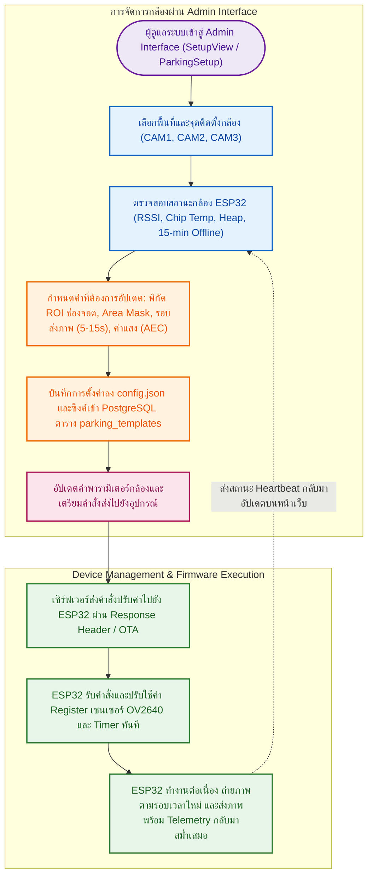

# Smart Campus Parking Ecosystem - Architecture Diagrams (`diagrams/`)

เอกสารและไฟล์แผนภาพแสดงสถาปัตยกรรมระบบนิเวศการตรวจจับและบริหารจัดการลานจอดรถอัจฉริยะ (Dr. Sum Parking Density Analytics Platform) ครอบคลุมตั้งแต่ชั้น IoT Edge, ระบบคลังข้อมูล Dual-Storage Data Lake, การประมวลผล AI Inference บน CPU, การฝึกสอนโมเดลบน Modal Cloud GPU, การเชื่อมต่อ External APIs และส่วนการแสดงผล Real-time Dashboard & LINE Chatbot

---

## 📁 โครงสร้างไฟล์ในโฟลเดอร์นี้

* **[`overviews.drawio`](overviews.drawio)**: ไฟล์โปรเจกต์หลักของ Draw.io (Multi-Page Diagram) ประกอบด้วย 7 หน้า (Tabs) ที่เปิดใช้งานบน [Draw.io / diagrams.net](https://app.diagrams.net/) ได้ทันที:
  1. **`1. System Overview Architecture`**: แผนภาพภาพรวมสถาปัตยกรรมระบบทั้งระบบ (End-to-End Enterprise Architecture พร้อม Adminer และ LangChain)
  2. **`2. CCTV Capture & Ingestion Pipeline`**: โฟลว์การรับภาพจากกล้อง 3 ตัว การจัดเก็บแบบ Dual-Storage การตรวจจับช่องจอด และการแจ้งเตือน
  3. **`3. Camera Device Management`**: โฟลว์การบริหารจัดการและตั้งค่ากล้องผ่าน Admin Interface ทางไกล
  4. **`4. Active Learning & Feedback Loop`**: โฟลว์คัดแยกผลตรวจจับความมั่นใจต่ำ (< 40%) และการวนลูป Re-label เพื่อปรับปรุงโมเดล
  5. **`5. Modal GPU Training & Deployment`**: โฟลว์การสั่งเทรนโมเดล YOLO บน Modal Cloud GPU การแสดงผล Terminal CLI สด และการนำโมเดลไปติดตั้งใช้งาน
  6. **`6. External APIs Integration Flow`**: โฟลว์แจกแจง API ภายนอกทั้งหมดที่ระบบเรียกใช้งาน (Roboflow, Modal, LINE, dotBlue LLM, HuggingFace)
  7. **`7. SSO & Real-Time Sync Pipeline`**: โฟลว์ระบบ Single Sign-On (Adminer DB UI :8088 & MinIO Console :9001) และการประเมินโอกาสว่าง 3 ระดับ (+15 นาที) พร้อม Live Ingestion Proxy (:5005)
* **`training_worker_architecture.drawio`**: แผนภาพการทำงานของระบบคิวเทรนเนอร์ Token Classification ผ่าน Redis Queue (ARQ)

---

## 🗺️ รายละเอียดแผนภาพแต่ละโฟลว์ (System Workflows)

### 1. ภาพรวมสถาปัตยกรรมระบบ (System Architecture Overview)
ครอบคลุม 6 เลเยอร์หลัก:
1. **IoT Edge Sensing Layer**: กล้อง ESP32-CAM 3 จุดติดตั้ง (`cam1`: หน้าภาค 1, `cam2`: หน้าภาค 2, `cam3`: ข้างภาคคอม) พร้อมระบบตรวจจับกล้อง Offline 15 นาที
2. **Data Lake Ingestion & Storage**: Ingestion Server (:5005) จัดเก็บภาพแบบ Time-Partitioned Dual Storage (Local Disk + MinIO S3 `raw-datasets`)
3. **Core Backend & Data Layer**: FastAPI Gateway (:8000/:8005), Redis Cache (:6379, `<0.5ms`), PostgreSQL 17 (:5432)
4. **AI Inference & Forecasting Engine**: Local CPU YOLO Detection, ROI Slot Polygon Intersection, SARIMAX Time-Series Forecast
5. **Presentation Layer**: React Web Application (Vite :5173), LINE Official Account Chatbot
6. **Observability Stack**: Grafana (:3000), Prometheus (:9090), Loki (:3100), Tempo (:3200), OpenTelemetry (:4317), MLflow (:5001)

---

### 2. โฟลว์การรับภาพและการประมวลผล (CCTV Capture & Ingestion Pipeline)

```mermaid
flowchart LR
    subgraph capture["1. การรับภาพจากกล้อง (Edge IoT)"]
        A["กล้อง ESP32-CAM (CAM1, CAM2, CAM3)<br/>ถ่ายภาพทุก 5 - 15 วินาที"] --> B["ส่งภาพ Snapshot + Header X-Telemetry<br/>(AEC, WiFi RSSI, Chip Temp, Heap)"]
    end

    subgraph storage["2. เซิร์ฟเวอร์รับภาพ & Dual-Storage"]
        C["Ingestion Server (:5005)<br/>แกะข้อมูลและตรวจสอบความถูกต้อง"] --> D["หมุนภาพ 180° ปรับ Brightness & Contrast<br/>สร้าง Telemetry JSON Companion"]
        D --> D1[("Local Disk Time-Partition<br/>data/dataset/camX/YYYY-MM-DD/HH/")]
        D --> D2[("MinIO S3 Object Storage<br/>Bucket: raw-datasets")]
    end

    subgraph processing["3. การประมวลผลภาพบน CPU"]
        E["YOLO Detection & Segmentation บน CPU"] --> F["คำนวณ ROI Slot Polygon Intersection<br/>และคำนวณ Zone Pixel Occupancy Density (%)"]
        F --> G["SARIMAX Predictive Model<br/>พยากรณ์ความหนาแน่นล่วงหน้า"]
        G --> H[("Redis Cache & PostgreSQL 17<br/>park_status / occupancy_logs")]
    end

    subgraph presentation["4. การแสดงผลและการแจ้งเตือน"]
        I["Live Cyber Dashboard (Vite :5173)<br/>แสดงผล ROI Overlay & Telemetry Alerts"]
        J["LINE Chatbot ('น้องจ๊อด หาที่จอดรถ')<br/>ตอบกลับและแจ้งเตือน Real-time"]
        K["Roboflow Cloud 30-Min & Bulk Sync<br/>เตรียมข้อมูลเพื่อการเรียนรู้"]
    end

    B --> C
    D1 & D2 --> E
    H --> I
    H --> J
    D1 --> K

    classDef captureStyle fill:#E3F2FD,stroke:#1565C0,stroke-width:2px,color:#0D47A1
    classDef storeStyle fill:#FFF8E1,stroke:#FFA000,stroke-width:2px,color:#B78103
    classDef processStyle fill:#FFF3E0,stroke:#EF6C00,stroke-width:2px,color:#E65100
    classDef outputStyle fill:#E8F5E9,stroke:#2E7D32,stroke-width:2px,color:#1B5E20

    class A,B captureStyle
    class C,D,D1,D2 storeStyle
    class E,F,G,H processStyle
    class I,J,K outputStyle
```



---

### 3. โฟลว์การจัดการและตั้งค่ากล้องทางไกล (Camera Device Management via Admin Interface)



---

### 4. โฟลว์คัดแยกผลตรวจจับความมั่นใจต่ำ (Active Learning & Feedback Loop)

```mermaid
flowchart TD
    A["ระบบตรวจจับรถจากภาพ (AI YOLO Inference)"] --> B{"ค่าความมั่นใจต่ำกว่า 40% หรือไม่?<br/>(Confidence Score < 0.40)"}
    B -->|ไม่ใช่ (>= 40%)| C["บันทึกผลตรวจจับความมั่นใจสูง อัปเดต Redis/PostgreSQL และแสดงผลสด"]
    B -->|ใช่ (< 40%)| D["จัดเก็บภาพและผลตรวจจับไว้ใน Feedback Loop Store (Flag: NEEDS_REVIEW)"]
    D -.->|แสดงผลชั่วคราวไม่ให้สะดุด| C
    D --> E["ส่งภาพเข้า Roboflow Annotate & Review Queue ผ่าน 30-Min & Bulk Sync"]
    E --> F["ผู้เชี่ยวชาญตรวจสอบและติดป้ายกำกับใหม่ (Human-in-the-Loop Re-labeling)"]
    F --> G["เพิ่มข้อมูลที่ตรวจทานแล้วเข้า Master Dataset และออกเลข Version ใหม่"]
    G --> H["นำชุดข้อมูลเวอร์ชันใหม่ไปฝึกโมเดลเพิ่มเติมบน Modal Serverless Cloud GPU"]
    H -.->|Deploy โมเดลใหม่กลับสู่ระบบตรวจจับ| A

    classDef start fill:#E3F2FD,stroke:#1565C0,stroke-width:2px,color:#0D47A1
    classDef decision fill:#FFF3E0,stroke:#EF6C00,stroke-width:2px,color:#E65100
    classDef success fill:#E8F5E9,stroke:#2E7D32,stroke-width:2px,color:#1B5E20
    classDef feedback fill:#FCE4EC,stroke:#AD1457,stroke-width:2px,color:#880E4F
    classDef training fill:#EDE7F6,stroke:#6A1B9A,stroke-width:2px,color:#4A148C

    class A start
    class B decision
    class C success
    class D,E,F feedback
    class G,H training

    linkStyle default stroke:#546E7A,stroke-width:2px
    linkStyle 1 stroke:#2E7D32,stroke-width:2px
    linkStyle 2,3,4,5 stroke:#AD1457,stroke-width:2px
```

---

### 5. สถาปัตยกรรมการฝึกและจัดการโมเดล AI ทั้ง 3 โมเดล และ MLflow (AI Models Lifecycle & MLflow Registry)

ระบบมีโมเดล AI ทั้งหมด 3 โมเดล โดยมีนโยบายการจัดเก็บและติดตามใน MLflow ดังนี้:
1. **Model 1: YOLO Object Detection & Segmentation (Vision Model)**:
   - ฝึกสอนบน Modal Cloud GPU (A10G/T4) ด้วย Dataset จาก Roboflow
   - ติดตามค่า Loss (box, cls, dfl), mAP50 และจัดเก็บ Checkpoint `best.pt` ใน **MLflow Model Registry**
   - Deploy สู่ Local CPU Inference Worker แบบ Zero-Downtime Hot-Reload
2. **Model 2: SARIMAX Time-Series Forecaster (Vacancy Probability)**:
   - นำข้อมูลสถิติย้อนหลัง `occupancy_logs` จาก PostgreSQL มา Fit โมเดล Seasonal ARIMA ($s=24$)
   - ประเมินผลความแม่นยำด้วย **Brier Score (&le;0.10)**, Reliability Calibration Curve, และ Out-of-Sample Accuracy
   - จัดเก็บพารามิเตอร์และผลการทดลองใน **MLflow Experiment 9 (`smart_parking_vacancy_prob`)**
   - Deploy เพื่อพยากรณ์ความน่าจะเป็นของช่องว่างล่วงหน้า 15 นาที แบ่งเป็น 3 ระดับ (สูง, ปานกลาง, เต็ม)
3. **Model 3: LINE Chatbot (dotBlue LLM / LangChain AI Agent)**:
   - **ไม่มีการเทรนน้ำหนักโมเดล (Pure API Inference):** ใช้โมเดลพื้นฐาน `openai/gpt-5.6-luna` ผ่าน OpenAI-Compatible API
   - **ไม่ต้องจัดเก็บ Weights ใน MLflow:** ใช้ระบบ Tool Calling (PostgreSQL, MinIO, Redis, SARIMAX) แบบ Zero-Shot
   - จัดเก็บเฉพาะประวัติการสนทนาลง PostgreSQL (`chat_logs`) เพื่อให้ Admin นำมาปรับปรุง **System Prompt Engineering** ในภายหลัง

```mermaid
flowchart TD
    subgraph track1["Track 1: Model 1 - YOLO Vision Model (Modal GPU & MLflow)"]
        Y_DATA["Roboflow Dataset<br/>Annotated Frames"] --> Y_TRAIN["Modal Cloud GPU<br/>Fine-tuning (A10G/T4)"]
        Y_TRAIN --> Y_EVAL{"mAP50 >= 85% ?"}
        Y_EVAL -->|ผ่าน| Y_MLFLOW["MLflow Model Registry<br/>Save best.pt & Metrics"]
        Y_MLFLOW --> Y_DEPLOY["Deploy Hot-Reload<br/>CPU Inference Worker"]
        Y_EVAL -->|ไม่ผ่าน| Y_RETRY["ปรับ Hyperparameters / Dataset"]
        Y_RETRY --> Y_TRAIN
    end

    subgraph track2["Track 2: Model 2 - SARIMAX Forecaster (Time-Series & MLflow Exp 9)"]
        S_DATA["PostgreSQL Logs<br/>occupancy_logs 30 วัน"] --> S_FIT["Fit Seasonal ARIMA (s=24)<br/>+ Exogenous Features"]
        S_FIT --> S_EVAL{"Brier Score <= 0.10 &<br/>ECE Calibration Pass ?"}
        S_EVAL -->|ผ่าน| S_MLFLOW["MLflow Experiment 9<br/>smart_parking_vacancy_prob"]
        S_MLFLOW --> S_DEPLOY["Deploy Forecaster (+15m)<br/>ทำนายโอกาสว่าง: สูง/กลาง/เต็ม"]
        S_EVAL -->|ไม่ผ่าน| S_TUNE["ปรับ Order (p,d,q) & Lags"]
        S_TUNE --> S_FIT
    end

    subgraph track3["Track 3: Model 3 - LINE Chatbot Agent (Inference Only / Prompt Tuning)"]
        C_IN["User ถามผ่าน LINE<br/>'อีก 15 นาที มีที่จอดไหม?'"] --> C_TOOLS["LangChain Tool Calling<br/>(Postgres, MinIO, SARIMAX)"]
        C_TOOLS --> C_LLM["dotBlue AI LLM (:8000)<br/>Pure API Inference (ไม่มีเทรน)"]
        C_LLM --> C_OUT["ตอบกลับ Flex Cards<br/>สรุปสถานะ + รูปสด + คาดการณ์"]
        C_OUT -.->|เก็บบันทึก Log ลง DB| C_LOG["PostgreSQL chat_logs<br/>นำมาจูน System Prompt"]
    end

    classDef yoloStyle fill:#FFF3E0,stroke:#EF6C00,stroke-width:2px,color:#E65100
    classDef sarimaxStyle fill:#E0F2F1,stroke:#00897B,stroke-width:2px,color:#004D40
    classDef chatStyle fill:#F3E5F5,stroke:#7B1FA2,stroke-width:2px,color:#4A148C

    class Y_DATA,Y_TRAIN,Y_EVAL,Y_MLFLOW,Y_DEPLOY,Y_RETRY yoloStyle
    class S_DATA,S_FIT,S_EVAL,S_MLFLOW,S_DEPLOY,S_TUNE sarimaxStyle
    class C_IN,C_TOOLS,C_LLM,C_OUT,C_LOG chatStyle
```



---

### 6. โฟลว์การเชื่อมต่อและดึงข้อมูลจากภายนอก (External APIs Integration Flow)

แผนภาพแสดงสถาปัตยกรรมการเชื่อมโยงภายนอก (External Services & Cloud APIs):

```mermaid
flowchart TD
    subgraph core["AI Ecosystem Core Platform (ศูนย์กลางระบบ)"]
        GATEWAY["FastAPI Gateway (:8000/:8005) & Ingestion Server (:5005)"]
        CACHE[("Redis Real-Time Cache<br/>parking:status:summary (<0.5ms)")]
        DB[("PostgreSQL 17 Database<br/>park_status, parking_templates, roboflow_uploads")]
        GATEWAY <--> CACHE
        GATEWAY <--> DB
    end

    subgraph ext_rf["1. Roboflow Cloud REST API"]
        RF_API["api.roboflow.com"]
        RF_DESC["• อัปโหลดภาพแบทช์ทุก 30 นาที (06:00-20:00)<br/>• Bulk Legacy Ingestion (300 รูป/ก้อน)<br/>• คิวติดป้ายกำกับ (Annotate Queue)<br/>• ดาวน์โหลด Dataset Version เพื่อฝึกโมเดล"]
        RF_API --- RF_DESC
    end

    subgraph ext_modal["2. Modal Serverless Cloud GPU"]
        MODAL_API["modal.com / Modal Python Client"]
        MODAL_DESC["• สั่งรัน GPU Training Job (NVIDIA A10G/T4)<br/>• สตรีม Live CLI Terminal Logs ผ่าน WebSocket<br/>• ส่งออกโมเดลน้ำหนัก (best.pt / best.onnx)"]
        MODAL_API --- MODAL_DESC
    end

    subgraph ext_line["3. LINE Messaging API"]
        LINE_API["api.line.me/v2/bot"]
        LINE_DESC["• รับ Webhook ข้อความจากผู้ขับขี่<br/>• ส่ง Interactive Flex Messages สรุปช่องจอดว่าง<br/>• ส่ง Push Notification แจ้งเตือนความหนาแน่น"]
        LINE_API --- LINE_DESC
    end

    subgraph ext_dotblue["4. dotBlue AI LLM Service & LangChain"]
        DOTBLUE_API["dotBlue OpenAI-Compatible Gateway<br/>(Model: openai/gpt-5.6-luna)"]
        LC_AGENT["LangChain Tool Calling Engine<br/>• DB Tool: query_postgres_slots()<br/>• Image Tool: fetch_minio_snapshot()<br/>• Cache Tool: get_redis_summary()"]
        DOTBLUE_DESC["• ผู้ช่วยอัจฉริยะ 'น้องจ๊อด หาที่จอดรถ'<br/>• Function Calling เรียก Tool อ่าน Postgres & MinIO<br/>• ตอบคำถามภาษาธรรมชาติพร้อม Flex Image"]
        DOTBLUE_API --- LC_AGENT --- DOTBLUE_DESC
    end

    subgraph ext_hf["5. Hugging Face Hub API"]
        HF_API["huggingface.co/api"]
        HF_DESC["• ดาวน์โหลด Base Datasets & Tokenizer Config<br/>• สำรองไฟล์เข้า MinIO datasets bucket"]
        HF_API --- HF_DESC
    end

    %% Connections
    GATEWAY <-->|HTTPS REST API (POST Batch / GET Versions)| RF_API
    GATEWAY <-->|HTTPS / WSS (Train Trigger & Live Telemetry Logs)| MODAL_API
    RF_API -.->|ดึง Dataset ที่ติดป้ายกำกับแล้วเข้าสู่การ์ดจอ| MODAL_API
    GATEWAY <-->|HTTPS Webhook In / Reply & Push Out| LINE_API
    LINE_API <-->|User Question / Flex Message Response| LC_AGENT
    LC_AGENT <-->|Tool Execution & RAG Context| DB
    LC_AGENT <-->|Fetch Live Snapshot Image| GATEWAY
    LC_AGENT <-->|Function Calling Protocol| DOTBLUE_API
    GATEWAY -->|HTTPS Dataset Pull| HF_API

    classDef coreStyle fill:#E1F5FE,stroke:#0288D1,stroke-width:2px,color:#01579B
    classDef rfStyle fill:#EDE7F6,stroke:#6A1B9A,stroke-width:2px,color:#4A148C
    classDef modalStyle fill:#FFF3E0,stroke:#EF6C00,stroke-width:2px,color:#E65100
    classDef lineStyle fill:#E8F5E9,stroke:#2E7D32,stroke-width:2px,color:#1B5E20
    classDef dotblueStyle fill:#F3E5F5,stroke:#4A148C,stroke-width:2px,color:#4A148C
    classDef hfStyle fill:#ECEFF1,stroke:#607D8B,stroke-width:2px,color:#263238

    class GATEWAY,CACHE,DB coreStyle
    class RF_API,RF_DESC rfStyle
    class MODAL_API,MODAL_DESC modalStyle
    class LINE_API,LINE_DESC lineStyle
    class DOTBLUE_API,DOTBLUE_DESC dotblueStyle
    class HF_API,HF_DESC hfStyle
```

---

### 7. โฟลว์ระบบ Single Sign-On (SSO) และการประเมินโอกาสว่าง 3 ระดับ (SSO & Real-Time Sync Pipeline)

แผนภาพแสดงการทำงานของฟีเจอร์ใหม่ที่เพิ่ง Commit ล่าสุด (`e39ea22`):
1. **Adminer Database UI (:8088)**: การเข้าใช้งานฐานข้อมูล PostgreSQL แบบ Auto-Login โดยไม่ต้องกรอกรหัสผ่านผ่าน `services/adminer/index.php`
2. **MinIO Storage Console (:9001)**: การล็อกอินอัตโนมัติแบบ Seamless ผ่าน `/api/v1/auth/sso/minio`
3. **3-Tier Vacancy Status (+15 นาที)**: การประเมินโอกาสว่าง 3 ระดับ (โอกาสมีที่จอดสูง / ปานกลาง / เต็ม) แยกประเภทรถยนต์และมอเตอร์ไซค์ เพื่อขจัดปัญหา False Positives
4. **Vite Ingestion Proxy & Concurrency Sync**: การส่งต่อ `/api/parking` และ `/api/forecast` ไปยัง Ingestion Server (:5005) และการผสานพิกัด ROI เข้ากับสถานะรถจอดแบบสด

```mermaid
flowchart TD
    subgraph sso["1. ระบบ Single Sign-On (SSO) Auto-Login"]
        A["ผู้ดูแลระบบคลิกดูฐานข้อมูล/คลังรูปภาพบนหน้าเว็บ (:5173)"] --> B{"เลือกบริการที่ต้องการเปิด"}
        B -->|PostgreSQL UI| C["FastAPI GET /api/v1/auth/sso/postgres"]
        C --> D["HTTP 302 Redirect ไปยัง :8088/"]
        D --> E["Adminer AutoLoginPlugin (index.php) ฉีดสิทธิ์อัตโนมัติ"]
        E --> F[("เข้าดูตารางในฐานข้อมูล ai_ecosystem ทันที")]

        B -->|MinIO Console| G["FastAPI GET /api/v1/auth/sso/minio"]
        G --> H["FastAPI ยิง POST /api/v1/login เบื้องหลัง"]
        H --> I["ฝัง Cookie token (HttpOnly, SameSite=Lax)"]
        I --> J[("เข้าสู่หน้า MinIO Storage Console (:9001) จัดการ Bucket ทันที")]
    end

    subgraph vacancy["2. การประเมินโอกาสว่าง 3 ระดับ (+15 นาที) & Live Slot Merge"]
        K["ฟังก์ชัน syncAllSlotsFromServer() เรียกคู่ขนาน Promise.all"] --> L["ดึงพิกัด ROI (/api/parking/roi)"]
        K --> M["ดึงสถานะจอดสด (/api/parking/status) ผ่าน Ingestion Proxy (:5005)"]
        L & M --> N["ผสาน occupied, vehicle_name, conf ลงในแต่ละช่องจอด"]
        N --> O{"ประเมินโอกาสว่าง (+15 นาที)"}
        O -->|รถยนต์ (CAM1, CAM2)| P["ว่าง >= 2: โอกาสมีที่จอดสูง (เขียว)<br/>ว่าง 1: โอกาสปานกลาง (เหลือง)<br/>ว่าง 0: เต็ม (แดง)"]
        O -->|มอเตอร์ไซค์ (CAM3)| Q["ว่าง >= 3 (หรือ >= 15%): โอกาสมีที่จอดสูง (เขียว)<br/>ว่าง >= 1: โอกาสปานกลาง (เหลือง)<br/>ว่าง 0: เต็ม (แดง)"]
        P & Q --> R["แสดงผลบน DashboardView, CameraModal และแจ้งเตือนผ่าน LINE Chatbot"]
    end

    classDef ssoStyle fill:#EDE7F6,stroke:#5C6BC0,stroke-width:2px,color:#1A237E
    classDef minioStyle fill:#FFEBEE,stroke:#E53935,stroke-width:2px,color:#B71C1C
    classDef syncStyle fill:#E0F2F1,stroke:#00897B,stroke-width:2px,color:#004D40
    classDef ruleStyle fill:#E8F5E9,stroke:#2E7D32,stroke-width:2px,color:#1B5E20

    class A,B,C,D,E,F ssoStyle
    class G,H,I,J minioStyle
    class K,L,M,N syncStyle
    class O,P,Q,R ruleStyle
```

---

## 🔌 สรุปตารางการใช้งาน External APIs

| API ภายนอก | Endpoint / Host | รูปแบบการเรียก (Protocol) | Authentication | ข้อมูลที่ส่ง / รับ (Payload) | จุดประสงค์การใช้งาน |
| :--- | :--- | :--- | :--- | :--- | :--- |
| **Roboflow Cloud** | `https://api.roboflow.com` | HTTPS REST (`GET`, `POST`) | `?api_key=...` | ภาพ JPEG/PNG, Bounding Boxes, `batch`, `tag`, Dataset YAML | อัปโหลดรูปจากกล้องเข้า Annotate Queue, สร้างและดาวน์โหลด Dataset Version |
| **Modal Cloud GPU** | `modal.com` / Modal Python Client | HTTPS / WebSocket RPC | Modal API Token | Parameters (epochs, batch, img_size), Live CLI Terminal Logs, Model Weights | ฝึกสอนโมเดล YOLO บน Serverless GPU และสตรีม Log แบบสด |
| **LINE Messaging** | `https://api.line.me/v2/bot/` | HTTPS Webhook & REST | Channel Secret + Bearer Token | Webhook Events, Flex Message JSON, Quick Reply Buttons | ให้บริการผู้ใช้สอบถามสถานะช่องจอดและส่งการ์ดแจ้งเตือน |
| **dotBlue AI LLM** | dotBlue OpenAI-Compatible API | HTTPS REST (`POST /v1/chat/completions`) | Bearer API Key | System Prompt + RAG Context ลานจอดสด + User Question | ตอบคำถามภาษาธรรมชาติในฐานะบอต "น้องจ๊อด หาที่จอดรถ" |
| **Hugging Face Hub** | `https://huggingface.co` | HTTPS REST | HF Access Token | Raw Datasets, Tokenizer Configs, Pretrained Weights | ใช้งานชุดข้อมูลและการจัดเก็บใน MinIO |

---

## 🛠️ การเปิดดูและแก้ไขไฟล์ Draw.io

1. เข้าเว็บไซต์ [app.diagrams.net](https://app.diagrams.net/)
2. คลิก **Open Existing Diagram** และเลือกไฟล์ [`overviews.drawio`](overviews.drawio)
3. คุณจะพบกับแท็บด้านล่างทั้ง 6 หน้า สามารถแก้ไข จัดตำแหน่ง หรือ Export เป็นภาพ PNG/SVG ได้ทันที
